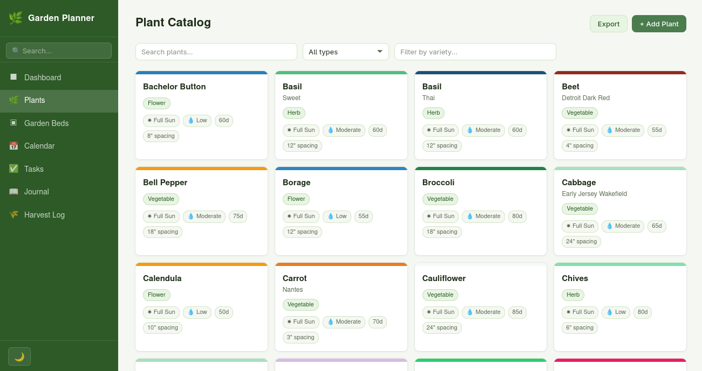

## Overview

Garden Planner is a web application for managing a personal garden. It allows
you to track plants, organize garden beds, schedule tasks, log harvests, and
take notes, all backed by a local SQLite database. The frontend is a
single-page application served by a Node.js/Express backend.

## Screenshots

  

## Features

- Track plants with detailed information and a built-in plant library
- Organize plants into named garden beds
- Calendar view for scheduling plantings and garden events
- Task management for garden chores and reminders
- Harvest log for recording yields over time
- Notes section for general garden journaling
- Global search across plants, beds, tasks, and notes
- Backup and restore support
- Runs entirely locally with no external dependencies

## Usage

## Dependencies

## License

This work is licensed under the GNU General Public License version 3 (GPLv3).

